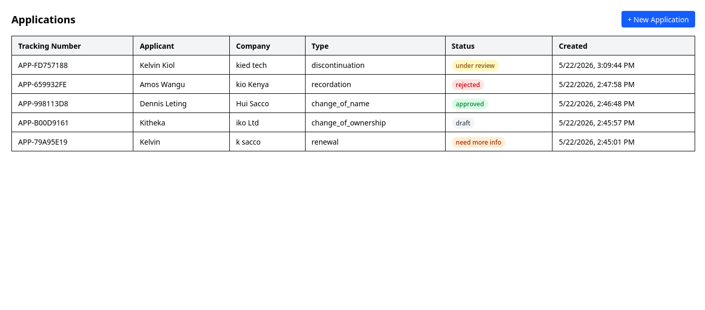
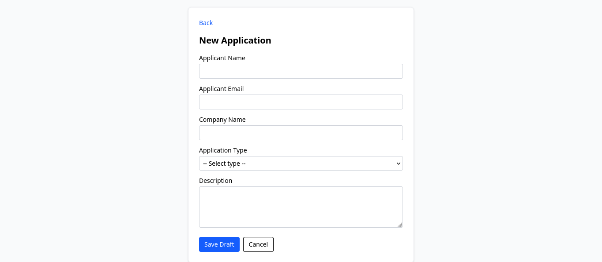
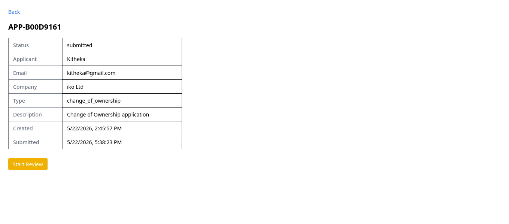
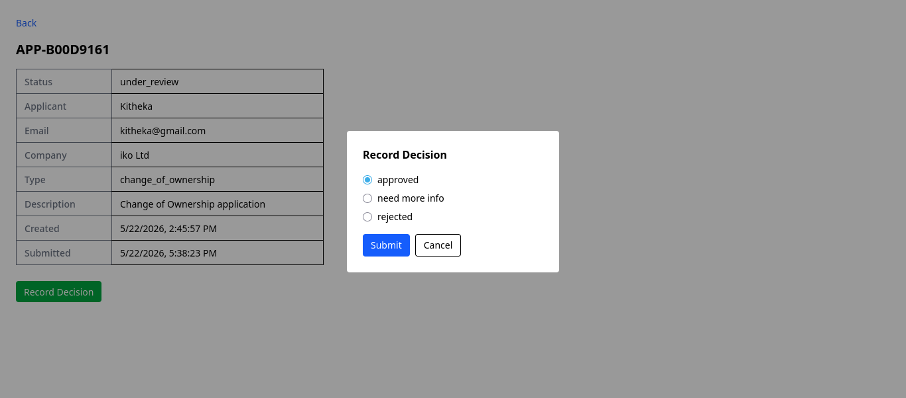
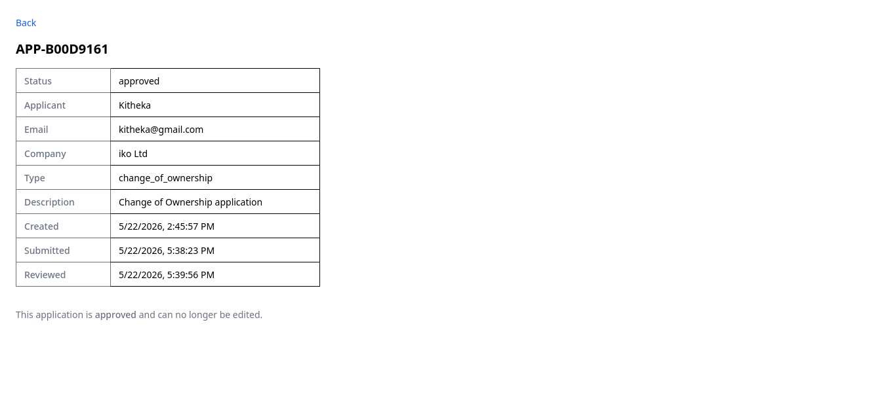

# Application Workflow Tracker

**Kelvin Kitheka**
📧 [kelvinkithekaofficial@gmail.com](mailto:kelvinkithekaofficial@gmail.com)

A small full-stack application workflow tracker built with Django (Django Ninja) and React (Vite + Tailwind CSS).


## Screenshots








---

## Tech Stack

- **Backend**: Python, Django, Django Ninja
- **Frontend**: React, Vite, Tailwind CSS, Axios, React Router

---

## Project Structure

```
project/
├── backend/
│   └── TrendPro/
│       ├── workflow/        ← app (models, schemas, api)
│       ├── config/          ← settings, urls
│       ├── manage.py
│       ├── requirements.txt
│       └── .env.example
└── frontend/
    └── src/
        ├── api/
        ├── components/
        ├── pages/
        └── App.jsx
```

---

## Getting Started

### Prerequisites

- Python 3.10+
- Node.js 18+

---

## Backend Setup

```bash
# 1. Navigate to the backend folder
cd backend/TrendPro

# 2. Create and activate a virtual environment
python -m venv venv
source venv/bin/activate   

# 3. Install dependencies
pip install -r requirements.txt

# 4. Set up environment variables
cp .env.example .env
# Open .env and fill in your SECRET_KEY, DEBUG, ALLOWED_HOSTS

# 5. Run migrations
python manage.py makemigrations
python manage.py migrate

# 6. Start the development server
python manage.py runserver
```

The API will be available at `http://localhost:8000/api/`


---

## Environment Variables

Create a `.env` file inside the `backend/` folder (or copy from `.env.example`):

```
SECRET_KEY=your-secret-key-here
DEBUG=True
ALLOWED_HOSTS=localhost,127.0.0.1
```

Generate a secret key with:

```bash
python -c "from django.core.management.utils import get_random_secret_key; print(get_random_secret_key())"
```

---

## Frontend Setup

```bash
# 1. Navigate to the frontend folder
cd frontend

# 2. Install dependencies
npm install

# 3. Start the development server
npm run dev
```

The app will be available at `http://localhost:5173`

---

## CORS

The backend uses `django-cors-headers` to allow requests from the frontend during development.

In `settings.py`:

```
CORS_ALLOW_ALL_ORIGINS = True  # development only
```

---

## API Endpoints

| Method | Endpoint | Description |
|--------|----------|-------------|
| POST   | `/api/applications` | Create a draft application |
| GET    | `/api/applications` | List all applications |
| GET    | `/api/applications/{id}` | Get application detail |
| PATCH  | `/api/applications/{id}` | Update a draft application |
| POST   | `/api/applications/{id}/submit` | Submit an application |
| POST   | `/api/applications/{id}/start-review` | Move to Under Review |
| POST   | `/api/applications/{id}/decision` | Record reviewer decision |

---

## Workflow

```
Draft → Submitted → Under Review → Approved
                               → Rejected
                               → Need More Information → (edit) → Submitted
```

### Rules

- Only **Draft** or **Need More Information** applications can be edited
- Only **Draft** or **Need More Information** applications can be submitted
- Only **Submitted** applications can move to **Under Review**
- Only **Under Review** applications can receive a decision
- **Approved** and **Rejected** applications cannot be edited
- A reviewer comment is required when deciding **Rejected** or **Need More Information**

---

## Application Types

- Recordation
- Renewal
- Change of Ownership
- Change of Name
- Discontinuation

---

## Assumptions

- No authentication is implemented; all endpoints are public
- Tracking numbers are auto-generated on creation (`APP-XXXXXXXX`)
- A single reviewer role is assumed; there is no user/role management
- The frontend connects to the backend at `http://localhost:8000` by default

---

## What I Would Improve With More Time

- Add authentication and role-based access (applicant vs reviewer)
- Paginate the application list
- Add filtering and search to the list screen
- Write unit tests for workflow transition logic
- Move the API base URL to an environment variable
- Add form validation feedback on the frontend
- Deploy with Docker
